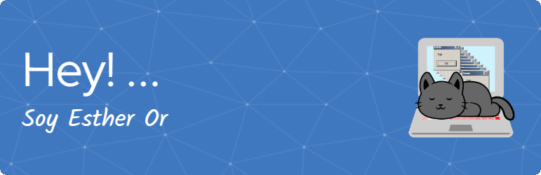

<!--
**str26/str26** is a ✨ _special_ ✨ repository because its `README.md` (this file) appears on your GitHub profile.--!>
<!--# 💫 About Me:
🔭 Actualmente estoy trabajando en mi lógica de programación  🌱 Estoy aprendiendo Python y Data  👯 Pensando en colaborar y practicar en Datacamp  👨‍💻 Todos mis proyectos lo puedes ver aqui, poquitos pero los encuentras  💬 Preguntas? Libro abierto sobre ansiedad/depresión, cambios, life, geopolítica y claro, programación  ⚡ Nunca es tarde para girar el timón

## 🌐 Socials:
   

# 💻 Tech Stack:
           
# 📊 GitHub Stats:
 
 

## 🐦 Latest Tweet

### ✍️ Random Dev Quote

### 😂 Random Dev Meme

---

--!>
